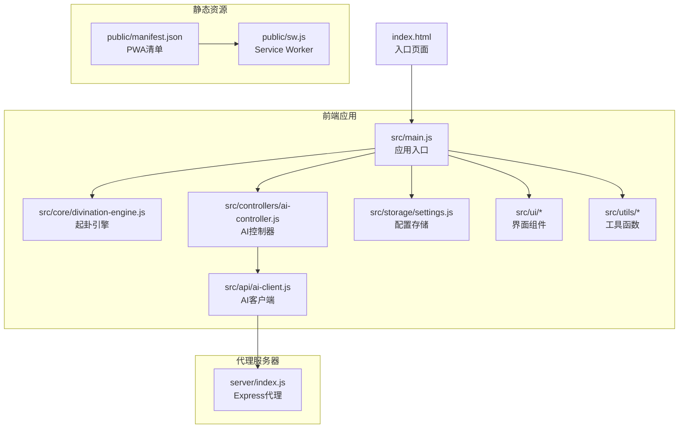
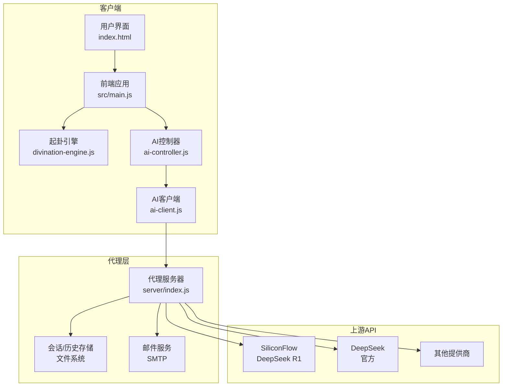
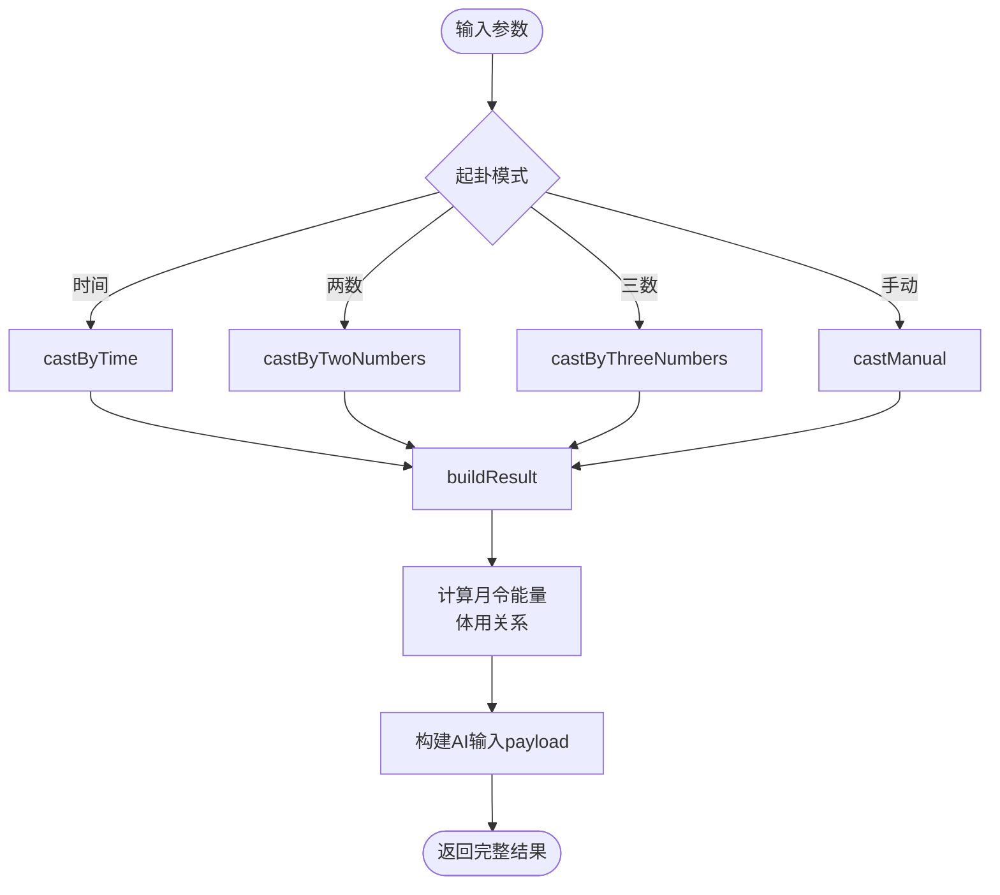
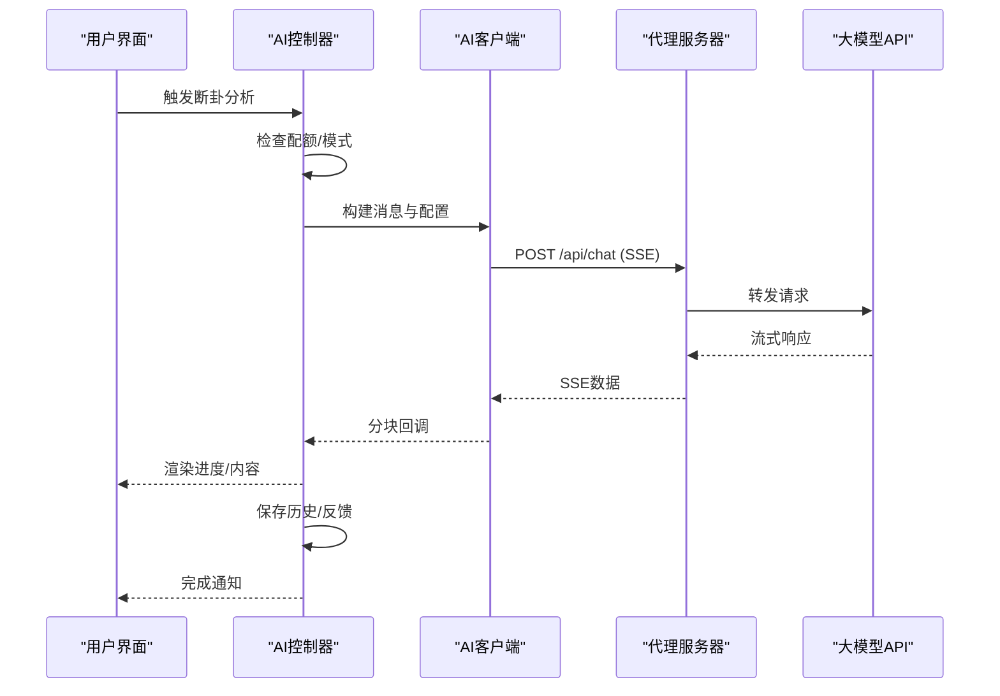
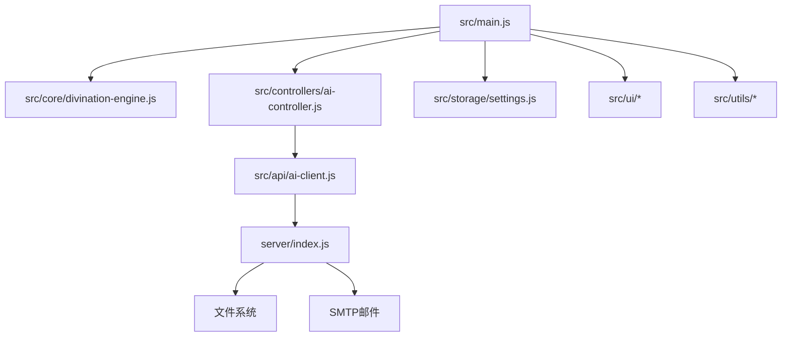

# 项目概述

<cite>
**本文档引用的文件**
- [package.json](file://package.json)
- [index.html](file://index.html)
- [src/main.js](file://src/main.js)
- [server/index.js](file://server/index.js)
- [src/core/divination-engine.js](file://src/core/divination-engine.js)
- [src/controllers/ai-controller.js](file://src/controllers/ai-controller.js)
- [src/api/ai-client.js](file://src/api/ai-client.js)
- [src/storage/settings.js](file://src/storage/settings.js)
- [public/manifest.json](file://public/manifest.json)
- [public/sw.js](file://public/sw.js)
- [vercel.json](file://vercel.json)
- [vite.config.js](file://vite.config.js)
- [__tests__/divination.test.js](file://__tests__/divination.test.js)
- [legacy/app-core.js](file://legacy/app-core.js)
</cite>

## 目录
1. [简介](#简介)
2. [项目结构](#项目结构)
3. [核心组件](#核心组件)
4. [架构总览](#架构总览)
5. [详细组件分析](#详细组件分析)
6. [依赖关系分析](#依赖关系分析)
7. [性能考量](#性能考量)
8. [故障排除指南](#故障排除指南)
9. [结论](#结论)
10. [附录](#附录)

## 简介
梅花义理是一个将古典《周易》与现代AI技术深度融合的数智决策系统，旨在通过数字化手段实现梅花易数占卜的现代化转型。项目提供SPA前端、代理服务器与API服务的三层架构，并通过PWA特性提升用户体验与离线能力。系统支持多种起卦方式（时间起卦、报数起卦、手动选卦），并以AI驱动的断卦分析为核心，为用户提供从卦象生成到义理解析的完整流程。

## 项目结构
项目采用模块化组织，前端核心位于src目录，后端代理服务位于server目录，静态资源与PWA配置位于public目录，构建工具与测试配置位于根目录。

**图表来源**
- [src/main.js:1-250](file://src/main.js#L1-L250)
- [server/index.js:1-120](file://server/index.js#L1-L120)
- [public/manifest.json:1-22](file://public/manifest.json#L1-L22)
- [public/sw.js:1-45](file://public/sw.js#L1-L45)

**章节来源**
- [package.json:1-32](file://package.json#L1-L32)
- [index.html:1-120](file://index.html#L1-L120)
- [src/main.js:167-250](file://src/main.js#L167-L250)

## 核心组件
- 起卦引擎：实现时间起卦、报数起卦、手动选卦的完整算法，支持体用生克、月令能量校准与三阶段推演。
- AI控制器：封装AI分析流程，支持流式输出、暂停/继续、模型切换对比、历史反馈学习。
- AI客户端：统一处理代理模式与直连模式，支持超时、重试、SSE流解析。
- 配置存储：管理提供商与模型配置，支持本地持久化与运行时覆盖。
- 代理服务器：提供CORS、会话管理、历史记录、邮件验证码、API代理与静态资源托管。

**章节来源**
- [src/core/divination-engine.js:23-201](file://src/core/divination-engine.js#L23-L201)
- [src/controllers/ai-controller.js:24-112](file://src/controllers/ai-controller.js#L24-L112)
- [src/api/ai-client.js:31-76](file://src/api/ai-client.js#L31-L76)
- [src/storage/settings.js:38-85](file://src/storage/settings.js#L38-L85)
- [server/index.js:12-100](file://server/index.js#L12-L100)

## 架构总览
系统采用三层架构：
- 前端SPA：负责用户交互、本地状态管理、UI渲染与AI分析调度。
- 代理服务器：作为API中转，隐藏密钥、提供会话与历史管理、邮件服务与静态资源。
- API服务：对接多家大模型提供商，支持流式响应与多线路备用。

**图表来源**
- [src/main.js:167-250](file://src/main.js#L167-L250)
- [src/controllers/ai-controller.js:24-112](file://src/controllers/ai-controller.js#L24-L112)
- [src/api/ai-client.js:12-25](file://src/api/ai-client.js#L12-L25)
- [server/index.js:42-56](file://server/index.js#L42-L56)

## 详细组件分析

### 起卦引擎（DivinationEngine）
- 支持三种起卦方式：时间起卦、两数法、三数法、手动选卦。
- 实现体用生克、月令能量校准、三阶段推演（缘起→过程→终局）。
- 提供卦象解析与payload构建，便于AI分析。

**图表来源**
- [src/core/divination-engine.js:35-201](file://src/core/divination-engine.js#L35-L201)

**章节来源**
- [src/core/divination-engine.js:23-433](file://src/core/divination-engine.js#L23-L433)

### AI控制器（AI Controller）
- 管理AI分析生命周期：配额检查、模式选择、系统提示词构建、流式输出处理。
- 支持暂停/继续、模型切换对比、历史记录保存与反馈学习。
- 统一错误处理与自动续传机制。

**图表来源**
- [src/controllers/ai-controller.js:24-112](file://src/controllers/ai-controller.js#L24-L112)
- [src/api/ai-client.js:78-184](file://src/api/ai-client.js#L78-L184)
- [server/index.js:514-646](file://server/index.js#L514-L646)

**章节来源**
- [src/controllers/ai-controller.js:24-733](file://src/controllers/ai-controller.js#L24-L733)

### AI客户端（AI Client）
- 支持代理模式与直连模式，自动重试与超时控制。
- 解析SSE流，分别传递推理内容与最终内容。
- 与代理服务器配合，实现密钥安全与跨域控制。

**章节来源**
- [src/api/ai-client.js:12-185](file://src/api/ai-client.js#L12-L185)

### 配置存储（Settings）
- 管理提供商与模型配置，支持默认端点与运行时覆盖。
- 提供API Key检测与模型选择持久化。

**章节来源**
- [src/storage/settings.js:38-85](file://src/storage/settings.js#L38-L85)

### 代理服务器（Server）
- Express服务，提供CORS、会话管理、历史记录、邮件验证码、健康检查。
- 多线路API代理，支持SSE流式转发与超时控制。
- 静态资源托管与SPA回退。

**章节来源**
- [server/index.js:12-668](file://server/index.js#L12-L668)

### PWA特性与构建优化
- PWA清单与Service Worker：提供离线缓存与安装引导。
- Vite插件移除crossorigin属性，解决微信浏览器CORS问题。
- Verce部署头配置，优化缓存策略。

**章节来源**
- [public/manifest.json:1-22](file://public/manifest.json#L1-L22)
- [public/sw.js:1-45](file://public/sw.js#L1-L45)
- [vite.config.js:1-20](file://vite.config.js#L1-L20)
- [vercel.json:1-23](file://vercel.json#L1-L23)

## 依赖关系分析

**图表来源**
- [src/main.js:167-250](file://src/main.js#L167-L250)
- [src/controllers/ai-controller.js:1-20](file://src/controllers/ai-controller.js#L1-L20)
- [src/api/ai-client.js:8-10](file://src/api/ai-client.js#L8-L10)
- [server/index.js:12-23](file://server/index.js#L12-L23)

**章节来源**
- [src/main.js:167-250](file://src/main.js#L167-L250)
- [src/controllers/ai-controller.js:1-20](file://src/controllers/ai-controller.js#L1-L20)

## 性能考量
- 流式SSE：代理服务器逐字节转发上游响应，避免中间层缓存导致的延迟。
- 超时与重试：客户端设置合理超时与重试策略，提升网络波动下的稳定性。
- 本地缓存：PWA缓存静态壳资源，减少重复下载。
- 构建优化：Vite移除crossorigin属性，降低跨域握手成本。

[本节为通用指导，无需特定文件引用]

## 故障排除指南
- 代理服务器未配置API密钥：检查.env文件与ALLOWED_ORIGINS配置。
- CORS错误：确认代理服务器允许的来源列表与部署域名匹配。
- 流式响应中断：检查网络连接与上游API状态，使用“继续”按钮自动续传。
- PWA安装失败：确认manifest.json与sw.js路径正确，且服务器缓存头配置合理。

**章节来源**
- [server/index.js:20-62](file://server/index.js#L20-L62)
- [src/api/ai-client.js:45-76](file://src/api/ai-client.js#L45-L76)
- [vercel.json:1-23](file://vercel.json#L1-L23)

## 结论
梅花义理通过三层架构与PWA特性，实现了古典易学与现代AI的有机融合。起卦引擎提供严谨的数理基础，AI控制器与客户端确保流畅的交互体验，代理服务器保障安全性与可扩展性。项目既满足初学者的易学入门需求，也为开发者提供了清晰的架构与完善的测试覆盖。

[本节为总结性内容，无需特定文件引用]

## 附录

### 快速开始指南
- 环境要求：Node.js、npm
- 安装依赖：在根目录与server目录分别执行安装
- 启动开发：根目录运行开发服务器，server目录运行代理服务
- 访问应用：浏览器打开本地开发地址，或通过代理服务器访问

**章节来源**
- [package.json:5-13](file://package.json#L5-L13)
- [server/index.js:5-10](file://server/index.js#L5-L10)

### 技术栈选择说明
- 前端：Vite提供快速热重载与构建优化；Lucide图标库；PWA支持。
- 后端：Express提供简洁的HTTP服务与中间件生态。
- 测试：Jest提供单元测试与覆盖率统计。
- 部署：Vercel提供CDN与缓存头配置，适配微信浏览器。

**章节来源**
- [package.json:24-31](file://package.json#L24-L31)
- [vercel.json:1-23](file://vercel.json#L1-L23)
- [vite.config.js:14-19](file://vite.config.js#L14-L19)

### 主要功能特性
- 多种起卦方式：时间、报数、手动选卦
- AI断卦分析：流式输出、暂停/继续、模型对比
- 历史记录：本地与云端同步、反馈学习
- 用户认证：会话管理、邮箱绑定、密码重置
- PWA支持：离线缓存、安装引导、主题切换

**章节来源**
- [src/main.js:296-554](file://src/main.js#L296-L554)
- [server/index.js:279-487](file://server/index.js#L279-L487)
- [public/manifest.json:1-22](file://public/manifest.json#L1-L22)

### 目标用户群体
- 易学爱好者：通过直观界面了解与实践梅花易数
- 决策者：借助AI义理解析辅助日常与商业决策
- 开发者：基于开源架构进行二次开发与集成

**章节来源**
- [src/controllers/ai-controller.js:526-733](file://src/controllers/ai-controller.js#L526-L733)

### 测试与质量保证
- 单元测试覆盖起卦引擎核心逻辑
- 模拟历史反馈学习，验证AI输出一致性
- 持续集成与代码规范检查

**章节来源**
- [__tests__/divination.test.js:1-174](file://__tests__/divination.test.js#L1-L174)

### 历史版本与迁移
- legacy/app-core.js展示了早期架构与全局桥接模式
- 现代版本采用模块化与状态管理，提升可维护性

**章节来源**
- [legacy/app-core.js:1-100](file://legacy/app-core.js#L1-L100)